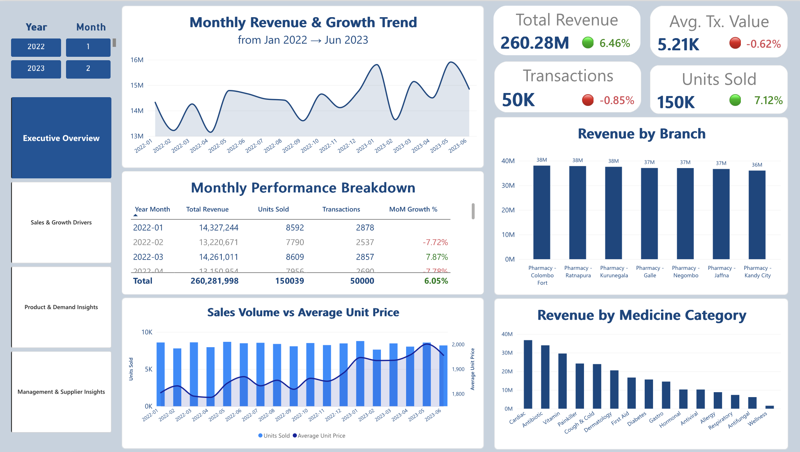
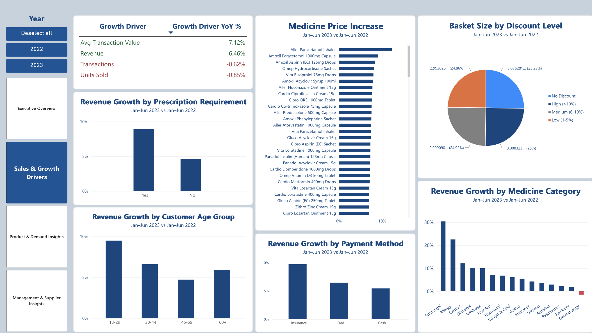
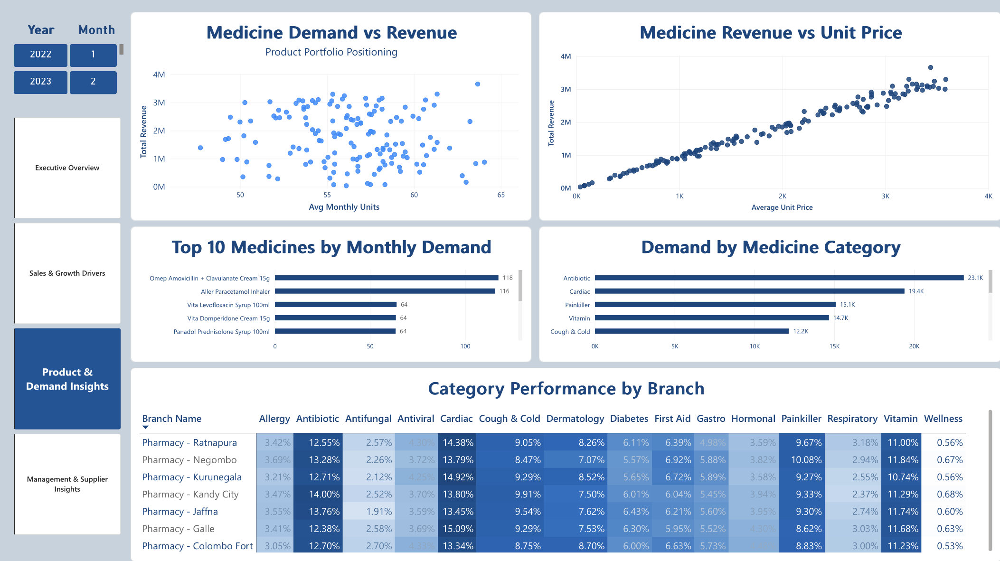
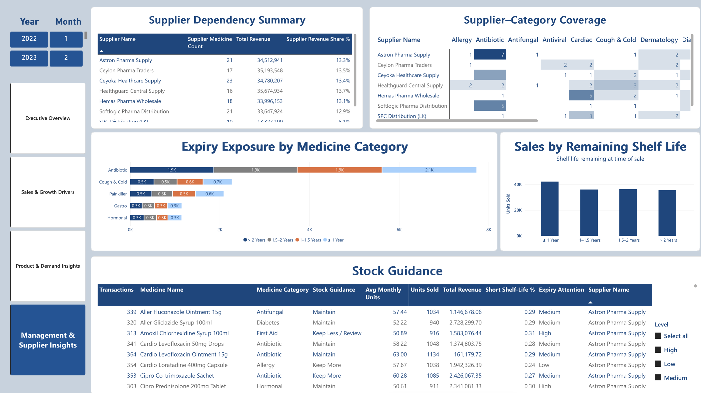

# 💊 Pharmacy Performance & Stock Decision Analytics

> An end-to-end business analytics project using **Python, MySQL, Power BI and DAX** to transform 50,000 pharmacy transactions into sales, product demand, stock, expiry and supplier decision support.

---

## 📌 Project Overview

This project analyses **50,000 pharmacy sales transactions** across **7 branches, 148 medicines and 8 suppliers**, covering January 2022 to June 2023.

The objective was to move beyond descriptive sales reporting and develop a management-focused analytics solution that answers:

- What is driving pharmacy revenue growth?
- Which medicines and categories contribute the most value?
- Which products deserve greater stocking attention?
- Which medicines require closer shelf-life monitoring?
- Are particular medicine categories dependent on specific suppliers?
- How does performance differ across branches?

The project follows an end-to-end analytics workflow:

**Raw Data → Python → MySQL → Power BI → Management Insights**

---

## 🎯 Business Objectives

The analysis was designed around four management areas:

1. **Performance Monitoring**  
   Track revenue, transactions, units sold and average transaction value over time.

2. **Growth Analysis**  
   Determine whether revenue growth is driven by higher demand, transaction activity, pricing or product mix.

3. **Product & Demand Analysis**  
   Identify financially important and high-demand medicines and categories.

4. **Stock, Expiry & Supplier Decision Support**  
   Combine historical demand, revenue contribution, shelf-life patterns and supplier coverage to support management review.

---

## 🛠️ Tools & Technologies

| Tool | Application |
|---|---|
| **Python / Pandas** | Data validation, cleaning, feature engineering and exploratory analysis |
| **MySQL** | Relational data modelling and SQL business analysis |
| **Power BI** | Interactive dashboard development and visual analytics |
| **DAX** | KPIs, time intelligence and management decision measures |
| **Excel** | Structured data transfer and validation |
| **Jupyter Notebook** | Python analysis and documentation |

---

## 🔄 Analytics Workflow

### 1. Data Preparation — Python

The raw transaction data was assessed before analysis to ensure that business conclusions were based on reliable information.

Key preparation included:

- Checking missing values and duplicate records
- Validating unique transaction IDs
- Reviewing categorical and numerical consistency
- Validating medicine ID and medicine name relationships
- Converting and validating transaction and expiry dates
- Checking discount, quantity and price ranges
- Validating transaction revenue calculations
- Investigating systematic missing medicine-strength values
- Creating analysis-ready features

Engineered features included:

- Year, quarter and month
- Year-Month
- Day of week
- Gross sales
- Discount amount
- Customer age group
- Discount group
- Days to expiry

---

### 2. Data Modelling & Analysis — MySQL

The cleaned data was structured into a star-schema model:

- `FactSales`
- `DimDate`
- `DimMedicine`
- `DimBranch`

SQL was then used to analyse:

- Overall sales KPIs
- Monthly and quarterly performance
- Month-over-month growth
- Comparable-period YoY growth
- Medicine price changes
- Product revenue contribution
- Branch performance

Because the dataset ends in **June 2023**, YoY analysis compares **Jan–Jun 2023 with Jan–Jun 2022** rather than incorrectly comparing six months of 2023 with the full 2022 year.

---

## 📊 Power BI Dashboard

The final Power BI solution contains four management-focused dashboard pages.

### 1️⃣ Executive Overview



Provides management with a high-level view of:

- Total Revenue
- Transactions
- Units Sold
- Average Transaction Value
- Monthly revenue trends
- YoY and MoM performance
- Branch performance
- Medicine category performance

#### Key Insights

- Generated **LKR 260.28M** in total revenue.
- Approximately **50,000 transactions** and **150,000 units** were recorded.
- Jan–Jun 2023 revenue increased **6.46% YoY**.
- Transactions decreased approximately **0.62%**.
- Units sold decreased approximately **0.85%**.
- Average Transaction Value increased approximately **7.12%**.
- Branch performance was highly balanced, with each branch contributing roughly **14% of total revenue**.

**Management takeaway:** Revenue performance improved, but the growth did not come from higher transaction or unit volume.

---

### 2️⃣ Sales & Growth Drivers



Investigates the factors behind the change in revenue, including medicine pricing, product categories, customer characteristics and discounts.

#### Key Insights

- Revenue increased **6.46%** despite slightly lower transactions and units sold.
- Average Transaction Value increased approximately **7.12%**.
- All **148 medicines** recorded higher average prices when comparing Jan–Jun 2023 with Jan–Jun 2022.
- Median medicine-level price growth was approximately **6.09%**.
- Revenue growth varied substantially between medicine categories.
- Average basket quantity remained around **3 units per transaction across discount levels**.
- Historical results therefore provide limited evidence that larger discounts were associated with larger baskets.

**Management takeaway:** Revenue growth appears primarily **value- and price-driven rather than volume-driven**. Revenue growth should therefore be evaluated alongside units and transactions rather than in isolation.

---

### 3️⃣ Product & Demand Insights



Examines medicine and category performance to understand both product demand and financial contribution.

#### Key Insights

- Average medicine demand was relatively balanced at approximately **48–64 units per month**.
- No small group of medicines overwhelmingly dominated monthly demand.
- Revenue contribution showed greater concentration than demand.
- Approximately **57% of medicines generated around 80% of total revenue**.
- The bottom **19% of medicines contributed only around 5% of revenue**.
- Medicines with similar sales movement can therefore have substantially different financial importance.
- Category performance also varies across branches, supporting more localised product planning.

**Management takeaway:** Stock importance should not be determined from units sold alone. **Demand and revenue contribution should be considered together.**

---

### 4️⃣ Management & Supplier Insights



Transforms the analysis into practical management decision support for stock planning, expiry monitoring and supplier dependency.

#### Key Insights

- The top three of eight suppliers represented approximately **42.3% of revenue**.
- Overall supplier-associated sales were relatively diversified rather than dominated by a single supplier.
- Supplier-category coverage highlights areas where individual medicine categories may have more concentrated sourcing.
- Historical remaining shelf life was analysed to identify medicines requiring relatively greater expiry attention.
- Medicines were classified into:
  - **Keep More**
  - **Maintain**
  - **Keep Less / Review**
- Expiry attention was separately classified as:
  - **High**
  - **Medium**
  - **Low**

### 💡 Medicine Stock & Expiry Decision Guide

The management table combines:

- Medicine
- Category
- Stock Guidance
- Management Action
- Average Monthly Demand
- Units Sold
- Revenue
- Short Shelf-Life %
- Expiry Attention
- Supplier

This allows management to identify products that warrant greater stocking attention while simultaneously considering historical shelf-life exposure.

**Management takeaway:** Stock decisions should balance **demand, financial contribution and expiry exposure**, rather than simply ordering more of the highest-selling products.

---

## 🔍 Major Business Findings

- **Revenue growth was not volume-led:** Jan–Jun revenue increased **6.46%**, while units and transactions both declined slightly.
- **Transaction value increased:** Average Transaction Value rose approximately **7.12%**.
- **Medicine prices increased broadly:** All **148 medicines** recorded higher average prices, with median growth of approximately **6.09%**.
- **Demand was relatively balanced:** Medicine-level monthly demand showed a narrow range, reducing the usefulness of simple fast/slow-mover classifications.
- **Financial contribution was more concentrated:** Around **57% of medicines generated 80% of revenue**.
- **Discounts showed limited relationship with basket size:** Average quantities remained around three units across discount levels.
- **Branch performance was highly balanced:** No branch showed substantial overall underperformance.
- **Supplier dependency was relatively diversified:** The top three suppliers accounted for approximately **42.3% of revenue**.
- **Stock and expiry should be considered together:** High-demand products may still require closer shelf-life monitoring when larger quantities are held.

---

## 💡 Management Recommendations

- **Protect high-value demand** by prioritising medicines combining strong demand with high revenue contribution.
- **Review weaker stock** where medicines show both lower relative demand and lower financial contribution.
- **Integrate expiry monitoring with stocking decisions**, particularly for products with historically higher short shelf-life exposure.
- **Separate price-led from demand-led growth** when evaluating future pharmacy performance.
- **Avoid assuming larger discounts increase basket size** without further evidence.
- **Use branch-category demand patterns** to support localised product allocation.
- **Monitor supplier concentration by category**, rather than evaluating suppliers using revenue alone.
- **Extend the model with current inventory and procurement data** to enable true reorder optimisation.

---

## ⚠️ Data Limitations

The dataset contains **historical sales transactions rather than current inventory records**.

Therefore, the dashboard cannot calculate:

- Current stock on hand
- Exact reorder quantities
- Safety stock requirements
- Days of inventory remaining
- Current products approaching expiry
- Supplier lead-time performance
- Product margins or gross profit

For this reason, classifications such as **Keep More**, **Maintain**, and **Keep Less / Review** should be interpreted as **management decision-support indicators**, not automated purchasing instructions.

Similarly, expiry analysis represents the **remaining shelf life at the time historical transactions occurred** and does not represent the pharmacy's current expiry exposure.

---

## 📁 Repository Structure

```text
pharmacy-performance-analytics/
│
├── README.md
│
├── notebooks/
│   └── pharmacy_analysis.ipynb
│
├── sql/
│   ├── schema.sql
│   └── analysis_queries.sql
│
├── powerbi/
│   └── Pharmacy_Performance_Dashboard.pbix
│
├── images/
│   ├── executive_overview.png
│   ├── sales_growth_drivers.png
│   ├── product_demand_insights.png
│   └── management_supplier_insights.png
│
└── docs/
    └── project_report.md
